# CRSM Architecture Diagram

This document visualizes the **Continuous Reasoning State Model** architecture, highlighting the interaction between the synchronous Mamba backbone ("System 1") and the asynchronous MCTS planner ("System 2") via the **Gated State Injection** mechanism.

## System Overview

```mermaid
%%{init: {'theme': 'base', 'themeVariables': { 'primaryColor': '#2980b9', 'secondaryColor': '#e74c3c', 'tertiaryColor': '#f1c40f', 'mainBkg': '#ecf0f1', 'nodeBorder': '#2c3e50', 'clusterBkg': '#ffffff', 'clusterBorder': '#bdc3c7'}}}%%

flowchart TB
    %% Define styles
    classDef backbone fill:#d4e6f1,stroke:#2980b9,stroke-width:2px,color:black;
    classDef planner fill:#fadbd8,stroke:#c0392b,stroke-width:2px,color:black;
    classDef state fill:#fcf3cf,stroke:#f39c12,stroke-width:2px,stroke-dasharray: 5 5,color:black;
    classDef injection fill:#d5f5e3,stroke:#27ae60,stroke-width:4px,color:black;

    %% Input
    Input(["Input Token x_t"]) --> Embedding[Token Embedding]
    
    subgraph Backbone ["🦁 Mamba Backbone (System 1: Fast Intuition)"]
        direction TB
        Embedding --> Layer1
        
        subgraph LayerN ["Mamba Layer Block"]
            direction TB
            SSM["SSM Core ($h_t = \bar{A}h_{t-1} + \bar{B}x$)"]:::backbone
            
            %% The Core Novelty: Gated Injection
            subgraph Gate ["🛡️ Gated Injection Mechanism"]
                direction TB
                Formula["$h_{new} \leftarrow (1-\alpha)h_{old} + \alpha h_{target}$"]:::injection
            end
            
            SSM -->|Current State $h_t$| Formula
        end
        
        Layer1("Layer 1"):::backbone --> LayerN
        Formula --> LayerNext("Layer ..."):::backbone
        LayerNext --> Norm[RMSNorm]
    end

    %% Output
    Norm --> Head[Output Projection]
    Head --> Logits(["Next Token Logits"])

    %% The Planner
    subgraph Planner ["🧠 Asynchronous MCTS Planner (System 2: Slow Deliberation)"]
        direction TB
        
        Snapshot[State Snapshot]:::planner
        Dynamics["🔮 Latent Dynamics ($f_\theta$)"]:::planner
        TreeSearch["🌲 Monte Carlo Tree Search"]:::planner
        ValueHead["💎 Value Estimator"]:::planner
        
        Snapshot --> TreeSearch
        TreeSearch <-->|Rollouts| Dynamics
        TreeSearch <-->|Evaluation| ValueHead
        
        TreeSearch -->|Best Child State| TargetState(["Target State h_target"]):::state
        TreeSearch -->|Certainty| Confidence(["Confidence Score"]):::state
    end

    %% Connections
    SSM -.->|Async Copy| Snapshot
    TargetState == "Corrective Signal" ==> Formula
    Confidence -.->|"Scales $\alpha$"| Formula

    %% Legend
    linkStyle 5 stroke:#27ae60,stroke-width:3px;
```

## Detailed Data Flow

1.  **Fast Path (Blue/Left):**
    *   The input token flows through the Mamba Backbone.
    *   The **SSM Core** calculates the natural next state $h_t$ based on history.
    *   **Gated Injection (Green):** Before this state is finalized or passed to the next step, it is interpolated with the MCTS Target State.
    *   The modified state produces the output logits.

2.  **Slow Path (Red/Right):**
    *   A **Snapshot** of the state is taken asynchronously.
    *   **MCTS** expands a reasoning tree using the **Latent Dynamics** model (a lightweight world model) to simulate future states without running the full backbone.
    *   The **Value Head** evaluates leaf nodes.
    *   The planner identifies a **Target State** ($h_{target}$) representing a "better" thought process.

3.  **The Fusion (Green Node):**
    *   The backbone state and the planner state collide.
    *   **Safety:** The update is gated by $\alpha$ (Injection Rate) and scaled by the planner's **Confidence**.
    *   If the planner is unsure, the state remains unchanged. If confident, the backbone is nudged toward the better reasoning path.

